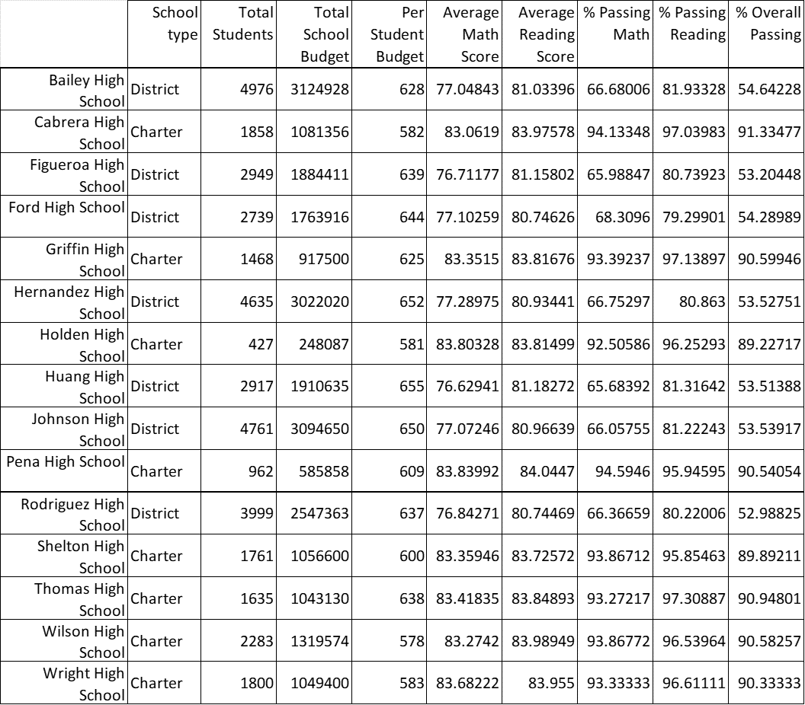
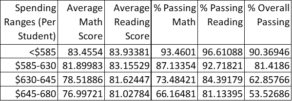
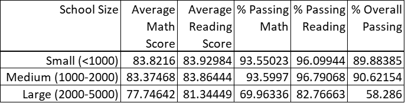

# School Analysis
In this report, district-wide standardized test results and spending data was used to analyze trends in school and student performance. Analysis was conducted at three levels:
- District-wide indicators
- School-level indicators
- Inter-School comparisons

Major conclusions are detailed in the following sections.
## District Summary
 

- Total Schools	15
- Total Students	39,170
- Total Budget	$24,649,428 
- Average Math Score	79
- Average Reading Score	81.9
- % Passing Math	75.00%
- % Passing Reading	85.80%
- % Overall Passing	65.20%

 

## Per-School Summary

In this section the key indicators about each school were generated. Table 1 shows a summary.

Table 1. Per school summary table.

## School Benchmarking

A number of comparisons were carried out between the schools in the district, including: 
- Highest and lowers performing schools by percent of overall passing (average math and reading scores above 70)
- Math and reading score by grade by school
- Scores by school per capita spending
- Scores by school size (by school and for the overall district)
- Scores by school type

Table 2. Scores by per capita spending.

Table 3. Scores by school size.

Table 4. Scores by school type.

# Conclusions

